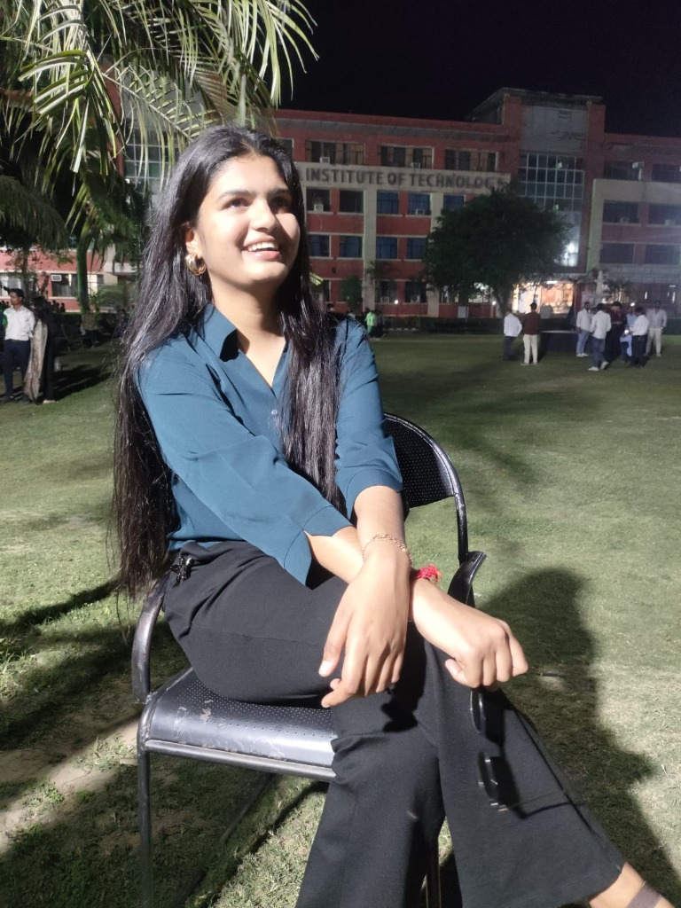
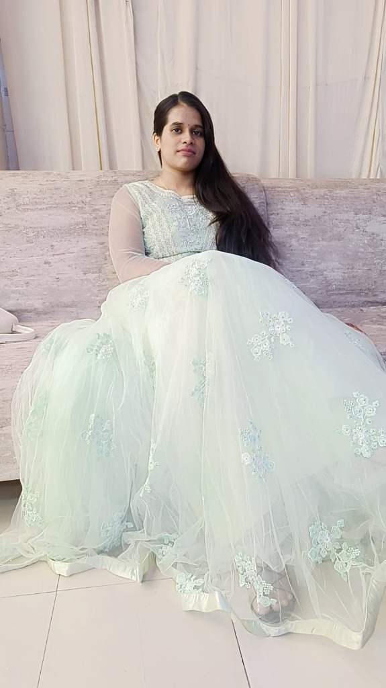
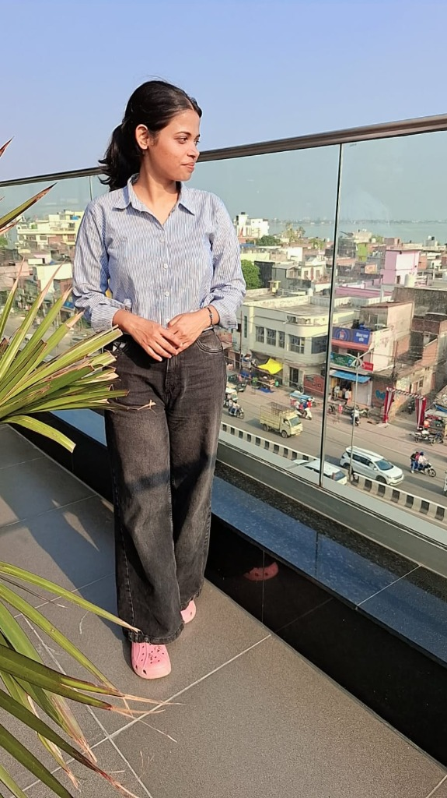

# ✨ Shrishti - Our Beautiful 3-Year Journey 💖

[](https://remarkable-speculoos-21347b.netlify.app/)
[](https://react.dev/)
[](https://vitejs.dev/)
[](https://tailwindcss.com/)
[](https://www.framer.com/motion/)

Welcome to the official repository of **Shrishti**, an ultra-premium, interactive personal memory and friendship showcase website. This portal was specifically designed to capture, preserve, and celebrate a gorgeous **3-year journey of three inseparable friends** (Shrishti, Nisha, and Priya).

🔗 **Live Website URL**: [https://remarkable-speculoos-21347b.netlify.app/](https://remarkable-speculoos-21347b.netlify.app/)

---

## 📸 Captured Memories (Our Trio & Highlights)

Here are the central pillars of our trio, beautifully integrated into the interactive layout:

<table align="center">
  <tr>
    <td align="center">
      
      <br />
      <b>Shrishti 🌸</b>
    </td>
    <td align="center">
      
      <br />
      <b>Nisha 💫</b>
    </td>
    <td align="center">
      
      <br />
      <b>Priya ✨</b>
    </td>
  </tr>
</table>

---

## 🌟 Premium Interactive Features

This portal is packed with modern UI aesthetics, vibrant dark-mode glassmorphism, and responsive micro-interactions:

### 1. 🌌 Dynamic Glassmorphic Hero Slider
* Sleek multi-image transition slider (`hero1.jpg`, `hero2.jpg`, `hero3.jpg`) accompanied by smooth typography entrance and a glowing "Start Journey" button that smooth-scrolls down.

### 2. ⚡ Glowing Neon Timeline ("Our 3-Year Journey")
* A beautifully animated vertical timeline tracking core memories with high-resolution image snapshots (`media__1779601639811_rotated.jpg`, `media__1779601627054_rotated.jpg`, `media__1779601842194.jpg`) and fading scroll reveal markers.

### 3. 🍱 Blur-Reveal Bento Grid Gallery ("A Thousand Words")
* An elegant, multi-aspect-ratio Bento Grid containing gallery showcases. When hovered, the images beautifully lift, reveal, and blur other panels to bring focus to the active frame.

### 4. 🪗 Expanding Accordion Video Memories ("Cherished Moments")
* An interactive accordion layout displaying memories. Hovering over any card expands it with high-priority animations while gently contracting others, showcasing a stunning fluid flex-grow transition.

### 5. 💌 Special Messages Envelope
* A premium interactive layout styled as a classic message card, which reveals heartfelt messages from the heart.

### 6. 🎉 Confetti Surprise Ending
* A hidden magical button that showers the entire screen with colorful celebratory confetti particles when clicked.

### 7. 🎵 Ambient Music Player
* A floating minimalist audio controller with smooth play/pause toggles and custom track navigation to accompany the user's emotional journey.

### 8. 🖱️ Magnetic Custom Cursor
* A trailing glowing circular pointer that glides around the screen, following mouse movements to add a premium desktop-app sensation.

---

## 🛠️ Technology Stack

* **Core**: React 19 & Vite 8
* **Styling**: Tailwind CSS v4 (Sleek dark-mode theme, customized keyframes, and custom utility properties)
* **Animations**: Framer Motion (Scroll triggers, accordion expands, 3D tilts, and state transitions)
* **Icons**: Lucide React
* **Hosting**: Netlify CDN (Zero-latency global deployment)

---

## 🚀 Local Installation & Run Guide

To run this project locally on your machine for further customization:

### 1. Clone the repository
```bash
git clone https://github.com/peehu12345/shrishti.git
cd shrishti
```

### 2. Install dependencies
```bash
npm install
```

### 3. Run in Development Mode
```bash
npm run dev
```
Open [http://localhost:5173/](http://localhost:5173/) in your browser to view it!

### 4. Build for Production
```bash
npm run build
```
This will compile the optimized React assets into the `dist/` directory, ready to be hosted on Netlify, Vercel, or GitHub Pages.

---

## 💖 Made with Love

Dedicated to the endless laughter, maggi at 2 AM, hostel night talks, and everlasting bond between Shrishti, Nisha, and Priya. ♾️
